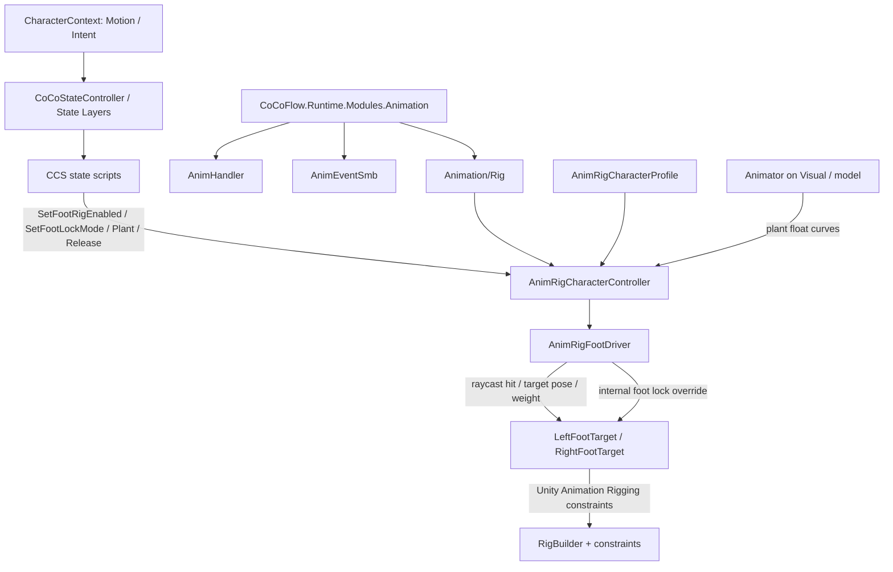

# Module: Animation

> Updated for CoCoFlow 0.3.9.

Animation 模块负责 Animator 轻封装、SMB 事件中转，以及 0.3.9 新增的 Rig 子能力。Rig 不是独立模块，也不是新的 `State Layer`；它是 Animation 模块内的脚部 IK 和脚步锁定 operation component。

## Topology



## Components

| Component | Responsibility |
|---|---|
| `AnimHandler` | Thin Animator facade and SMB event relay. |
| `AnimEventSmb` | StateMachineBehaviour event trigger based on normalized time. |
| `AnimRigCharacterController` | Character-level facade API for State Layer scripts. |
| `AnimRigFootDriver` | Samples left/right foot ground hits, owns foot lock runtime, and writes target transforms. |
| `AnimRigCharacterProfile` | Shared ScriptableObject for probe, blend, lock threshold, and ground-layer settings. |

## State Layer Integration

Foot IK is disabled by default. State scripts resolve `AnimRigCharacterController`
the same way they resolve `CharacterLocomotion`, then call operation methods only
for states that need foot correction:

```csharp
rigController.SetFootRigEnabled(true);
rigController.SetFootLockMode(AnimRigFootLockMode.AnimationDriven);
```

Recommended defaults:

| State type | Animation Rig operation |
|---|---|
| Idle / Move | `SetFootRigEnabled(true)` and `SetFootLockMode(AnimRigFootLockMode.AnimationDriven)` |
| Jump / Airborne | `ReleaseAllFeet()` then `SetFootRigEnabled(false)` |
| Attack / Interact | Leave the current mode alone, or explicitly `PlantFoot(...)` only for authored planted actions. |

`AnimationDriven` reads Animator Controller float parameters driven by animation
curves with the same names. By default the parameter / curve names are:

- `CoCoFlow_LeftFootPlant`
- `CoCoFlow_RightFootPlant`

The curves are treated as stance signals, not final IK weights. Values above
`PlantEnterThreshold` request Plant, values below `PlantExitThreshold` request
Release, and the middle range keeps the current lock state. If a bad curve stays
high forever, safety release suppresses re-planting until that curve first falls
below the exit threshold.

`Automatic` remains available as a velocity-based fallback for temporary
characters without curves. `Explicit` accepts only direct `PlantFoot` /
`ReleaseFoot` calls. Rig belongs to the Animation module, but it does not require
calls to pass through `AnimHandler`.

## Prefab Setup

Minimum character setup:

```text
PlayerRoot
  AnimRigCharacterController
  AnimRigFootDriver
  LeftFootTarget
  RightFootTarget
  Visual
    Animator
    RigBuilder
```

Each foot binding in `AnimRigFootDriver` should reference:

- `Foot Bone`: animated foot bone.
- `IK Target`: target Transform consumed by the project's Unity Animation Rigging constraint.
- `Hint Target`: optional pole/hint Transform for the constraint setup.
- `Raycast Origin`: optional custom probe point; if empty, the foot bone is used.

`AnimRigFootDriver` writes target transforms and exposes calculated weights. Constraint weight wiring remains in the prefab or project-specific bridge, so CoCoFlow does not own a full-body rig graph.

## Dependencies

The Animation module compiles without a Rig-specific support define. Unity Animation Rigging is still needed by projects or samples that consume the foot target transforms through Unity constraint components.

## Boundaries

- Does not create a Rigging State Layer.
- Does not extend `CharacterContext`.
- Does not generate procedural locomotion or steps.
- Does not implement hand IK, weapon mounts, full-body animation, retargeting, or network synchronization in 0.3.9.
