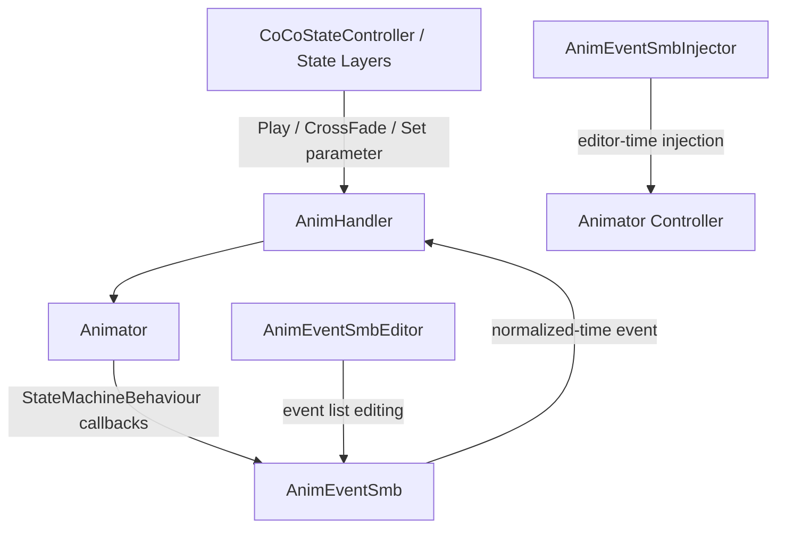

# Module: Animation

> Updated for CoCoFlow 0.3.9.

Animation is a thin Animator / SMB utility layer. It does not contain a built-in
IK solver, rig graph, weapon mount system, procedural locomotion system, or
full-body animation stack.

## Topology



## Components

| Component | Responsibility |
|---|---|
| `AnimHandler` | Thin Animator facade for `Play`, `CrossFadeInFixedTime`, parameter writes, layer weight, speed, and SMB event relay. |
| `AnimEventSmb` | `StateMachineBehaviour` that triggers named events when normalized animation time reaches configured thresholds. It stores per-Animator state so shared SMB assets do not leak trigger flags between instances. |
| `AnimEventSmbInjector` | Editor window that injects `AnimEventSmb` into all states of an Animator Controller, with an option to clear existing instances first. |
| `AnimEventSmbEditor` | Custom inspector for editing `AnimEventSmb` event names and trigger times. |

## Runtime Usage

Place `AnimHandler` beside the character `Animator`:

```text
PlayerRoot
  Visual
    Model
      Animator
      AnimHandler
```

Gameplay or State Layer code can resolve `AnimHandler` and call the small
operation surface:

```csharp
animHandler.CrossFadeAnimation("Move", 0.1f);
animHandler.SetFloat("MoveSpeed", speed);
animHandler.SetBool("IsGrounded", isGrounded);
```

For animation-authored events, subscribe to `OnSpecificFrameEvent`,
`OnAnimStateEnter`, or `OnAnimStateExit` from project-side code. CoCoFlow keeps
the event payload as a string so projects can route it into their own gameplay
contracts without the Animation module learning business-specific semantics.

## Editor Workflow

Open `CoCoFlow/AssetPipeline/SMB 注入器`, assign an Animator Controller, then run
the injection. The tool traverses Animator layers and nested state machines,
adding `AnimEventSmb` to states that do not already contain one. When the clear
option is enabled, existing `AnimEventSmb` behaviours are removed before
reinjection.

After injection, configure each state's event list in the `AnimEventSmb`
inspector. `Trigger Time` is normalized state time in the `0..1` range.

## Boundaries

- Does not create a Rigging State Layer.
- Does not extend `CharacterContext`.
- Does not include Foot IK, hand IK, weapon mounts, full-body animation,
  retargeting, or network synchronization.
- Does not add Unity Animation Rigging or Final IK as a package dependency.
- Projects can still use external rig or IK tools behind their own State Layer
  operation scripts.
