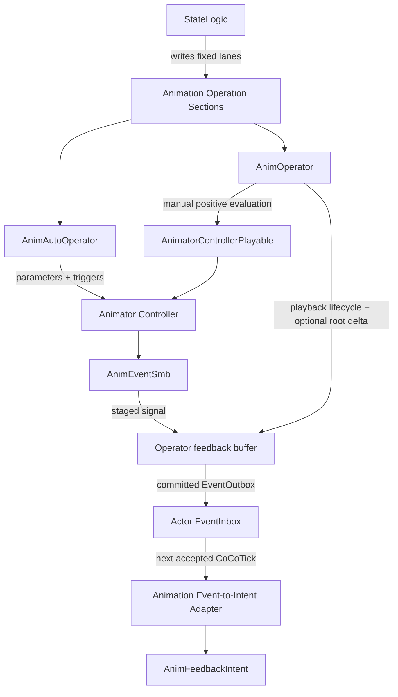

# Module: Animation

Animation V2 is a thin Animator Controller integration for the CoCoFlow
`OperationFrame -> Operator -> committed Event input` path. The Animator
Controller remains the state-machine and transition-authoring authority.
CoCoFlow exposes fixed-capacity mappings into that Controller; it does not
duplicate the Controller as another authored state machine.

The production runtime contains exactly two Animation `MonoBehaviour`
components:

- `AnimAutoOperator`: parameter and trigger delivery only.
- `AnimOperator`: a manually evaluated `AnimatorControllerPlayable` for
  parameter, trigger, playback, modulation, and optional root-motion feedback.

`AnimEventSmb` remains a `StateMachineBehaviour`. `AnimRootMotionRelay` is an
internal plain helper owned by `AnimOperator`, not a third component.

## Data Flow

```mermaid
flowchart TD
  StateLogic["StateLogic"] -->|"writes fixed lanes"| Sections["Animation Operation Sections"]
  Sections --> Auto["AnimAutoOperator"]
  Sections --> Advanced["AnimOperator"]
  Auto -->|"parameters + triggers"| Animator["Animator Controller"]
  Advanced -->|"manual positive evaluation"| Playable["AnimatorControllerPlayable"]
  Playable --> Animator
  Animator --> SMB["AnimEventSmb"]
  SMB -->|"staged signal"| OperatorBuffer["Operator feedback buffer"]
  Advanced -->|"playback lifecycle + optional root delta"| OperatorBuffer
  OperatorBuffer -->|"committed EventOutbox"| Inbox["Actor EventInbox"]
  Inbox -->|"next accepted CoCoTick"| Adapter["Animation Event-to-Intent Adapter"]
  Adapter --> Intent["AnimFeedbackIntent"]
```

There is no callback edge from Animator, SMB, Playable, or root motion into
StateGraph. Feedback becomes typed `AnimFeedbackEvent` input only after a
successful Actor commit.

Feedback produced while `AnimOperator` evaluates its Playable is written with
that Operator execution, published after commit, and can be projected on the
next accepted CoCoTick. A Direct Animator/SMB callback is first staged in the
receiving Operator, written by its next successful Operator commit, and then
projected on the following accepted CoCoTick. This intentional delay keeps the
State Flow acyclic.

## Operation Sections

`AnimOperationSchema` supplies the four per-project view factories and the
matching requirements:

| Section | Mode | Fixed surface |
|---|---|---:|
| `IAnimParameterOperationSection` | Continuous | 16 lanes |
| `IAnimTriggerOperationSection` | Discrete | 8 lanes |
| `IAnimPlaybackOperationSection` | Discrete | 1 control + 4 layer lanes |
| `IAnimModulationOperationSection` | Continuous | 8 lanes |

The unified feedback Event has a fixed capacity of 16 records per Operator
execution. Project registration must use the same `AnimOperationSchema`
factory instances when binding the Section views. Stable non-zero binding IDs
connect StateLogic commands to Inspector-authored mappings; runtime execution
does not use string-key lookup.

The seventeenth staged feedback record poisons the whole reliable batch. The
Operator rejects the transaction and publishes none of the first 16 records;
it never truncates the tail silently. Rebuilding bindings clears the batch,
and a new Host Graph instance or Timeline Epoch discards a poisoned batch from
the old timeline automatically.

`AnimAutoOperator` requires only Parameter and Trigger Sections. It owns no
Playable graph, playback token, modulation, root-motion relay, or Temporal
restore path.

`AnimOperator` additionally requires Playback and Modulation Sections and owns
the `AnimPlaybackContext` outcome. It publishes Activation-, TimelineEpoch-,
OperationSequence-, and layer-scoped `AnimPlaybackToken` values with
`Playing`, `CrossFading`, `Completed`, or `Interrupted` lifecycle state;
`AnimPlaybackContext.IsHeld` separately records the graph hold.

## Authoring and Inspector Workflow

1. Author layers, states, transitions, Blend Trees, parameters, and clips in
   the Unity Animator Controller.
2. Add either `AnimAutoOperator` or `AnimOperator` beside the `Animator`. The
   two components are mutually exclusive on one Animator.
3. Bind the same-boundary `CoCoStateGraphHost`.
4. Map stable binding IDs to existing Controller parameters, triggers, layers,
   and full state paths. `AnimOperator` may also map modulation targets.
5. Add `AnimEventSmb` to Controller states manually or use
   `CoCoFlow/Animation/Inject Anim Event SMB`. Give each marker a stable binding ID
   and normalized trigger time.

The custom inspectors validate Controller ownership, fixed capacities,
duplicate IDs and targets, parameter types, Controller layers, and full state
paths. They do not edit or mirror the Animator state machine. Runtime binding
rebuild is available in Play Mode after Inspector changes.

`AnimEventSmb` emits State Enter, configured Marker, and State Exit signals. It
keeps per-Animator trigger state so one shared SMB asset does not leak marker
flags between Animator instances. Marker delivery scans the absolute
normalized-time interval `(previous, current]`, including multiple loop
boundaries and the tail observed on State Exit. Backwards or non-finite time
only establishes a new cursor; it does not synthesize reverse events.
For a visible non-looping state, `AnimOperator` classifies normalized time
`>= 1` as `Completed` before considering its outgoing transition. An earlier
transition remains `Interrupted`; during a same-state transition, the active
token reads the next state instance rather than the outgoing instance. Outward
SMB records remain committed Events and never become direct StateGraph
callbacks.

## Playable Evaluation

`AnimOperator` owns one manual `AnimatorControllerPlayable`; it is not a
generic Playable wrapper.

- **Tick mode** evaluates with the current positive CoCoTick delta while
  playback is not held.
- **Step mode** evaluates only when a positive `Step` control command is
  delivered.
- `Play` and `CrossFade` target mapped Controller states and resume a held
  graph.
- `Stop` holds evaluation, stops owned modulation, and interrupts active
  playback tokens.

Zero, negative, NaN, and infinite Step values are rejected. Animation V2 does
not run negative Tick delta and does not evaluate the Playable graph backwards.

## Root-Motion Feedback

`AnimOperator` can enable its internal `AnimRootMotionRelay` and independently
select position and rotation forwarding. The relay captures
`Animator.deltaPosition` and `Animator.deltaRotation` during manual evaluation
and emits one typed root-motion feedback record.

The relay never writes a `Transform`, `CharacterController`, or `Rigidbody`.
Gameplay/world movement remains owned by a later State Flow consumer. The
one-Tick feedback delay is therefore explicit presentation-to-gameplay input,
not an immediate root-motion side effect.

## Optional Integrations

- `COCOFLOW_DOTWEEN_SUPPORT` enables
  `CoCoFlow.Runtime.Modules.Animation.DOTween`. Adapter-owned modulation ticks
  only tweens created and owned by the Animation adapter; it never calls the
  global `DOTween.ManualUpdate`.
- `COCOFLOW_UNITASK_SUPPORT` enables
  `CoCoFlow.Runtime.Modules.Animation.UniTask`.
  `WaitForTerminalStatusAsync` waits for one published playback token.
  Cancelling the `CancellationToken` cancels only the waiter and never sends
  `Stop` or changes animation playback.

Neither package is a hard dependency of CoCoFlow.

## Temporal Boundary

Exact Animator replay is the most important long-term Animation temporal goal,
but its bounded-anchor replay gate did not pass within the frozen Pre11 size
budget. `AnimOperator.ExactTemporalReplay` is therefore
`AnimExactReplayStatus.Deferred`.

The Operator may participate in ordinary forward capture plumbing, but Preview,
projection, Confirm preparation, restore, and world correction fail closed
before Animation authority moves. Pre11 provides no approximate pose restore,
negative Playable evaluation, or claim of perfect replay.

## Non-goals

- A generic or low-level Playable abstraction.
- A second authored animation state machine, profile asset, or Controller
  replacement.
- Built-in IK, Animation Rigging, weapon mounts, procedural locomotion,
  retargeting, or full-body animation.
- Direct Animator/SMB callbacks into StateGraph.
- World-transform application of root-motion deltas.
- Approximate or backwards-evaluated Temporal replay.
