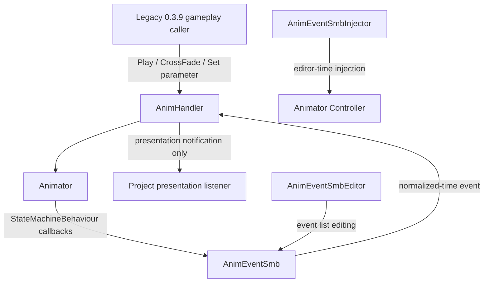

# Module: Animation

> Pre4 transition note (`0.4.0-pre.4`): `AnimHandler`, `AnimEventSmb`, and the
> current Animator Controller tooling are retained 0.3.9 implementations. They
> remain historical/transition code until Animation V2 in Pre11 and are not
> frozen 0.4 APIs.
>
> An Animator or `StateMachineBehaviour` callback must never call StateGraph,
> request an immediate transition, or mutate the current IntentFrame,
> OperationFrame, or ContextFrame. Gameplay callbacks must enter a later Tick
> through an Event-to-Intent boundary; presentation-only callbacks may remain
> local to the Animation module.

Animation is a thin Animator / SMB utility layer. It does not contain a built-in
IK solver, rig graph, weapon mount system, procedural locomotion system, or
full-body animation stack.

## Topology


```mermaid
flowchart TD
  LegacyCaller["Legacy 0.3.9 gameplay caller"] -->|"Play / CrossFade / Set parameter"| AnimHandler["AnimHandler"]
  AnimHandler --> Animator["Animator"]
  Animator -->|"StateMachineBehaviour callbacks"| AnimEventSmb["AnimEventSmb"]
  AnimEventSmb -->|"normalized-time event"| AnimHandler
  AnimHandler -->|"presentation notification only"| ProjectListener["Project presentation listener"]
  Injector["AnimEventSmbInjector"] -->|"editor-time injection"| AnimatorController["Animator Controller"]
  Editor["AnimEventSmbEditor"] -->|"event list editing"| AnimEventSmb
```

## Components

| Component | Responsibility |
|---|---|
| `AnimHandler` | Thin Animator facade for `Play`, `CrossFadeInFixedTime`, parameter writes, layer weight, speed, and SMB event relay. |
| `AnimEventSmb` | `StateMachineBehaviour` that triggers named events when normalized animation time reaches configured thresholds. It stores per-Animator state so shared SMB assets do not leak trigger flags between instances. |
| `AnimEventSmbInjector` | Editor window that injects `AnimEventSmb` into all states of an Animator Controller, with an option to clear existing instances first. |
| `AnimEventSmbEditor` | Custom inspector for editing `AnimEventSmb` event names and trigger times. |

## Legacy 0.3.9 Runtime Usage

Place `AnimHandler` beside the character `Animator`:

```text
PlayerRoot
  Visual
    Model
      Animator
      AnimHandler
```

The retained 0.3.9 runtime allows project gameplay code to call the small facade
below. This example is documentation for existing transition code only. New 0.4
StateLogic produces an Animation OperationFrame Section; an Animation Operator
introduced in Pre11 consumes it and owns the concrete Animator/Playable calls.
StateLogic must not resolve `AnimHandler` directly.

```csharp
animHandler.CrossFadeAnimation("Move", 0.1f);
animHandler.SetFloat("MoveSpeed", speed);
animHandler.SetBool("IsGrounded", isGrounded);
```

For animation-authored events, subscribe to `OnSpecificFrameEvent`,
`OnAnimStateEnter`, or `OnAnimStateExit` from project-side code. CoCoFlow keeps
the event payload as a string for retained 0.3.9 project callbacks. This string
surface is not the 0.4 gameplay packet format. A 0.4 adapter must translate a
gameplay-relevant animation edge into an immutable typed `EventPacket<TEvent>`;
the Router delivers it to an Actor EventInbox and an Event-to-Intent Adapter
makes it visible no earlier than a later Tick. Presentation callbacks may update
presentation-local state. Neither path may call StateGraph or make a write
visible inside the current Tick.

## Editor Workflow

Open `CoCoFlow/AssetPipeline/SMB 注入器`, assign an Animator Controller, then run
the injection. The tool traverses Animator layers and nested state machines,
adding `AnimEventSmb` to states that do not already contain one. When the clear
option is enabled, existing `AnimEventSmb` behaviours are removed before
reinjection.

After injection, configure each state's event list in the `AnimEventSmb`
inspector. `Trigger Time` is normalized state time in the `0..1` range.

## StateGraph ActionProgress boundary

Pre4 StateGraph Transition windows use an Activation-scoped `ActionProgress`
value in `0..1`, not a fixed duration and not a Completion flag. This lets
slow-motion, speed-up, and ordinary forward animation playback retain the same
proportional gameplay window. The Runtime sweeps the crossed half-open interval
`[StartInclusive, EndExclusive)` each Tick, so a large positive Delta cannot
silently jump over the window; reaching `1` never exits a State automatically.

The retained `AnimEventSmb` normalized-time callbacks are one possible project
input for a later Tick, but they are not the Transition evaluator. A callback
must enter through a typed Event-to-Intent Adapter and can then contribute the
next Tick's progress or intent. It cannot request a Transition or modify the
current Tick. Pre11 owns a formal Animator/Playable progress adapter and any
mapping needed for visual reverse playback. StateGraph time remains forward;
negative Tick Delta and true gameplay reverse execution are outside the design.

## Boundaries

- Current SMB callbacks are retained transition notifications; there is no
  direct callback edge into StateGraph, Operator execution, or ContextFrame.
- Pre11 owns the Playable graph, Animation OperationFrame Sections and Operators,
  transition animation, combo timing, controllable playback state, and
  root-motion ownership decisions.
- Does not create a Rigging State Layer.
- Does not add Animation data to the Pre2 ContextFrame or OperationFrame schema.
- Does not include Foot IK, hand IK, weapon mounts, full-body animation,
  retargeting, or network synchronization.
- Does not add Unity Animation Rigging or Final IK as a package dependency.
- Projects can still use external rig or IK tools behind their own Operators.
