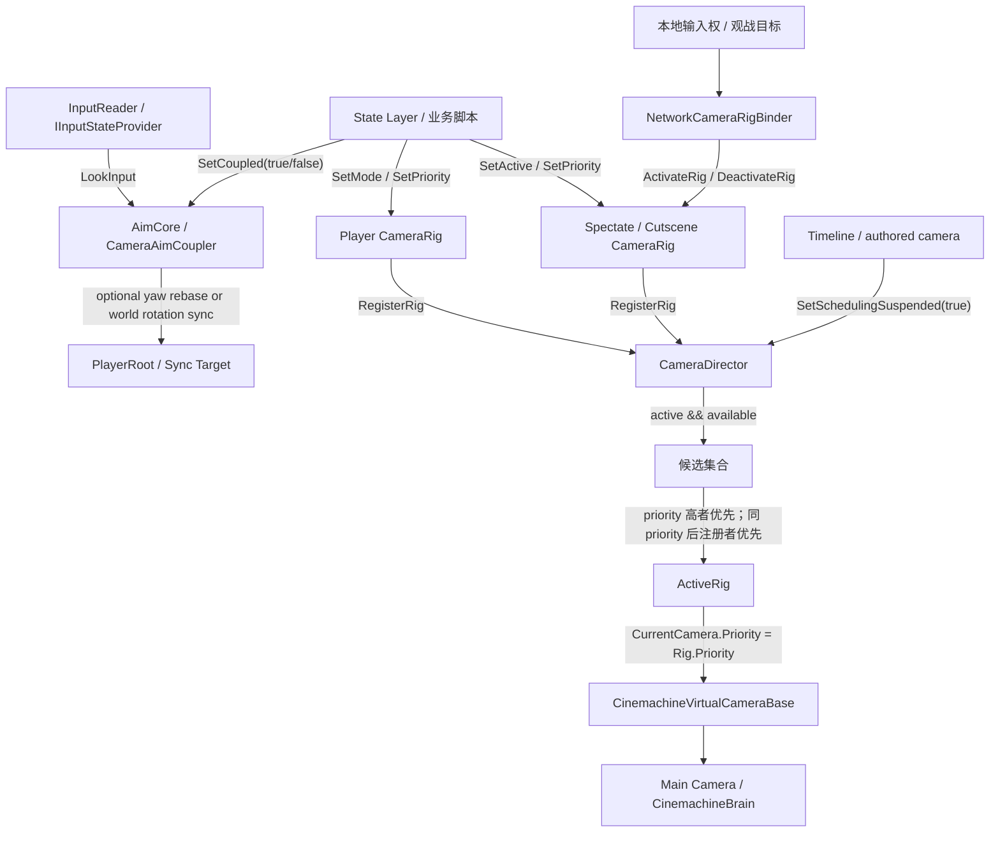

# Module: Camera

> Updated for CoCoFlow 0.3.8.

Camera 是 CoCoFlow 的本地表现层相机模块，只服务 3D 第三人称游戏。它不负责同步玩法状态，不替代 Cinemachine，也不自己实现 orbit、碰撞、阻尼、构图或 Timeline blend。它的职责很窄：收集一组 `CameraRig`，按 active + priority 选择当前 winner，然后把 winner 的当前 Cinemachine virtual camera 提升到运行时 priority。

当前 Camera 模块收束为调度、相机容器和可选 AimCore 末端脚本：

- `CameraDirector`：场景级调度器，只负责注册 rig、过滤 active/available、按 priority 仲裁 winner。
- `CameraRig`：挂在玩家、观战对象、cutscene anchor 或特殊镜头对象上，内部持有 Free/Aim/Lock/Spectate/Focus/Custom 等模式相机，并产出当前 virtual camera。
- `CameraAimCoupler`：挂在 AimCore 上，读取 `IInputStateProvider.LookInput` 旋转 AimCore，并可把 AimCore 的旋转同步给一个绑定 Transform。同步目标是 AimCore 祖先时只搬运水平 yaw，并回写 AimCore 本地旋转，避免父子层级二次叠加。

核心原则：State Layer 决定玩法状态，`CameraRig` 暴露表现参数，`CameraDirector` 只仲裁谁生效。

## 运行拓扑



## 核心组件

| 组件 | 作用 |
|---|---|
| `CameraDirector` | 场景里的本地相机调度器。默认注册成 `ICameraDirector` 服务，接受任意数量的 `CameraRig`，按 priority 选择当前 rig。 |
| `CameraRig` | 相机表现单元。保存 rig id、priority、active 和 Free/Aim/Lock/Spectate/Focus/Custom 子相机，并提供运行时 setter。 |
| `CameraRigMode` | rig 内部模式枚举。它只是表现选择，不是玩法状态机。 |
| `CameraAimCoupler` | AimCore 末端脚本。显式绑定 `IInputStateProvider`，读取 Look 输入旋转自身；`Coupled` 开启时同步旋转给绑定 Transform。非祖先目标会收到完整 world rotation；祖先目标会收到水平 yaw，并让 AimCore 保持原 world aim。 |
| `ICameraDirector` | 给业务层或 sample adapter 使用的轻接口。提供 rig 注册、激活、priority 调整、暂停调度和 active rig 事件。 |
| `NetworkCameraRigBinder` | Network Samples 里的示例桥接。把本地相机权威翻译成 rig active/priority，而不是同步 camera mode。 |

## Scene 组装

推荐最小场景结构：

```text
Main Camera
  Camera
  CinemachineBrain

CameraSystem
  CameraDirector

Player Prefab
  AimCore
    CameraAimCoupler
    CameraFollow
    FireOrigin
  CameraRig
  VCam_Free
  VCam_Aim
  VCam_Lock

CutsceneAnchor / SpectateAnchor / BossCameraAnchor
  CameraRig
  VCam_Free 或 VCam_Custom
```

组装步骤：

1. `Main Camera` 挂 `Camera` 和 `CinemachineBrain`。
2. 场景里建一个 `CameraSystem`，挂 `CameraDirector`，保持 `Register As Service` 开启。
3. 玩家 prefab 内建 `AimCore`，在 AimCore 上挂 `CameraAimCoupler`，显式绑定实现 `IInputStateProvider` 的输入源和可选同步目标。
4. 玩家 prefab 上挂 `CameraRig`，把玩家内部的 Cinemachine virtual cameras 拖到 Free/Aim/Lock/Spectate/Focus 字段。
5. 在每台 Cinemachine virtual camera Inspector 里直接配置 Follow/LookAt/ThirdPersonFollow target，例如指向 `AimCore` 或其子节点；`CameraRig` 不会运行时重绑 target。
6. 玩家 spawn 后，让本地玩家 rig 保持 active，并设置默认 priority，例如 `70`。
7. 远端玩家、观战目标、cutscene anchor 也可以各自带 `CameraRig`，但默认 inactive 或较低 priority。
8. State Layer 只操作本玩家 rig 的 mode/priority，以及 AimCore coupler 的 coupled 开关；Director 自动决定当前使用哪个 rig。

## 运行时用法

玩家状态脚本不要向 Director 请求 “Aim profile”。它应该控制自己身上的 rig：

```csharp
public override void Enter(ICoCoContext context)
{
    base.Enter(context);

    _cameraRig.SetMode(CameraRigMode.Aim);
    _cameraRig.SetPriority(70);
    _aimCoupler.SetCoupled(true);
}

public override void Exit(ICoCoContext context)
{
    _cameraRig.SetMode(CameraRigMode.Free);
    _aimCoupler.SetCoupled(false);

    base.Exit(context);
}
```

锁定或聚焦目标：

```csharp
_cameraRig.SetMode(CameraRigMode.Lock);
```

Lock camera 的 Follow/LookAt 目标由对应 Cinemachine camera 自己在 Inspector 配置，或由项目业务脚本直接设置该 camera 的 target；`CameraRig` 不负责 target 写入。

死亡后降低本地玩家相机优先级，把观战 rig 打开：

```csharp
localPlayerRig.SetPriority(60);

spectateRig.SetActive(true);
spectateRig.SetPriority(65);
spectateRig.SetMode(CameraRigMode.Spectate);
```

这会让 Director 选中观战 rig。复活时把本地玩家 priority 恢复到 `70`，并关闭观战 rig 即可。

## Priority 约定

Priority 是声明式抢占权。Director 每次刷新时只看 active rig：

- priority 高者胜出。
- priority 相同则后注册者胜出。
- inactive、disabled、没有 current camera 的 rig 不参与。
- winner 的 `CurrentCamera.Priority` 会被设为 rig priority，其他已注册 rig 的子相机会被清到 `0`。

建议项目层约定一组区间：

| 区间 | 建议用途 |
|---|---|
| `100+` | Timeline/cutscene/authored camera anchor。 |
| `80-99` | 强制特写、强制 Boss 机制镜头。 |
| `70` | 本地玩家默认控制镜头。 |
| `65` | 死亡观战、队友幽灵跟随。 |
| `60` | 本地玩家死亡后保留的低优先级兜底镜头。 |
| `0-50` | 调试、远端默认、inactive 前的备用值。 |

这些数值不是框架规则，只是推荐。框架规则只有 active + priority。

## TPS Aim 模式

Aim 模式保留在 `CameraRig` 内部，原因是它是第三人称游戏常见表现模式，不应该变成 Director 的全局 request。

推荐结构是玩家 prefab 内部有一个可由输入旋转的 `AimCore`：

- Free 模式下，`AimCore` 可以跟随输入旋转，但角色 prefab 不一定跟着转。
- Aim 模式下，`AimCore` 继续控制镜头朝向，`CameraAimCoupler.Coupled` 可以把 AimCore 的旋转同步给绑定 Transform。绑定 Root/父级这类祖先目标时，Coupler 只把水平 yaw 搬到 Root，并修正 AimCore 本地 yaw；绑定非祖先目标时才写完整 world rotation。
- Cinemachine 只负责相机位置、肩部偏移、阻尼、碰撞和准星辅助，不承载玩法状态转移。

这接近 Cinemachine ThirdPerson with Aimmode demo 的关键思路：相机绕的是玩家内部的 aim core，而不是让全局 camera orbit 状态机直接驱动玩家。

`CameraAimCoupler` 不做 fallback：不会自动找 `InputReader`、父级 Root、`CameraRig` 或 Cinemachine camera。缺少 `inputStateProvider` 时不读取输入也不旋转；缺少 `syncTarget` 时只旋转 AimCore，不同步任何对象。

## 联机边界

Camera 是本地表现，不是权威 gameplay state：

- 不要把当前 camera mode 同步进 `CharacterContext`。
- 不要同步 Unity `Transform` 引用。
- 不要让 StateAuthority 决定客户端镜头。
- 网络层只负责决定“这个客户端当前应该看谁”，然后本地激活对应 `CameraRig` 并调整 priority。

Network Samples 里的 `NetworkCameraRigBinder` 做的就是这件事。Fusion adapter 可以在 spawn、authority 变化或观战目标变化时调用：

```csharp
cameraRigBinder.SetLocalCameraAuthority(Object.HasInputAuthority);
```

观战不是同步别人的视角，而是在本地把相机挂到队友身上的 `CameraRig` 或 spectate anchor。这样每个客户端仍然有自己的 Cinemachine 视角控制和阻尼。

## Cutscene 交接

如果 cutscene 自己也是一个 `CameraRig`，直接让它 active 并给更高 priority：

```csharp
cutsceneRig.SetActive(true);
cutsceneRig.SetPriority(100);
```

如果 Timeline 或 authored camera 要完全接管，可以暂停 Director 调度：

```csharp
director.SetSchedulingSuspended(true);
```

恢复 gameplay camera：

```csharp
director.SetSchedulingSuspended(false);
```

暂停期间，Director 会把已注册 rig 的子相机 priority 清到 `0`。恢复后，它会重新按当前 active + priority 选择 winner。

## v1 暂不做的事

- 不写自己的 orbit/碰撞/遮挡算法，交给 Cinemachine。
- 不把镜头状态同步成网络权威状态。
- 不在框架里定义战斗镜头、震屏、IK、枪口校正的完整业务系统。
- 不把 Camera 变成第二套 State Layer。Aim/Lock/Spectate 是 rig 的表现模式，状态转移仍由项目已有 State Layer 管。
