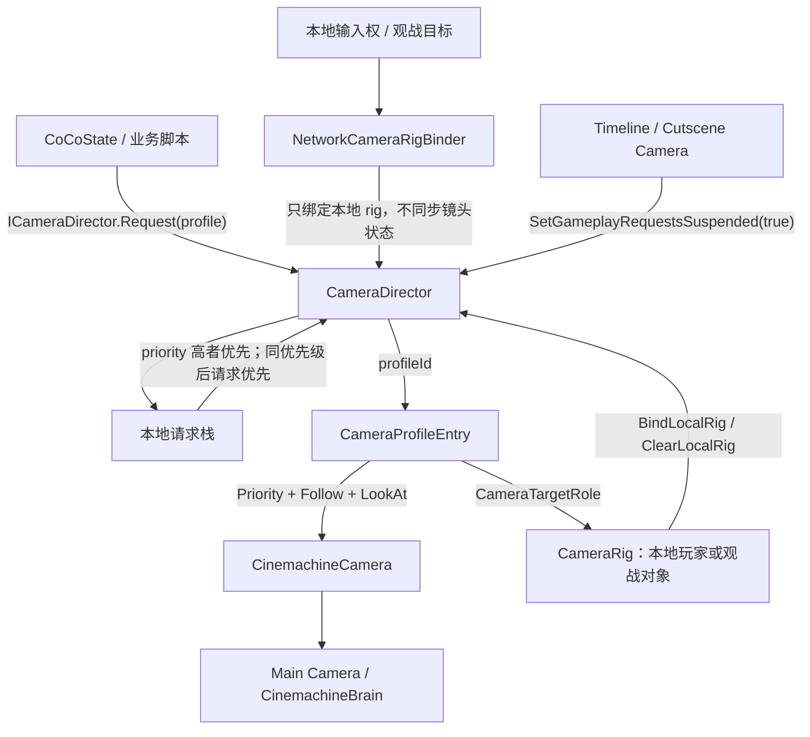

# Module: Camera

Camera 是 CoCoFlow 的本地表现层相机模块，只服务 3D 第三人称游戏。它不负责同步玩法状态，不替代 Cinemachine，也不自己实现 orbit、碰撞、阻尼、构图或 Timeline blend。它的职责很窄：把 State Layer 或业务脚本发出的“我要某个镜头模式”翻译成一组预配置的 Cinemachine 3 camera profile。

当前版本目标是 Camera v1 地基：够接入 TPS、瞄准、Boss 战拉远、聚焦动画、死亡观战和 cutscene handoff，但不把复杂战斗镜头系统塞进框架。

## 运行拓扑



核心原则：CoCoFlow 选 profile，Cinemachine 负责镜头表现。

## 核心组件

| 组件 | 作用 |
|---|---|
| `CameraDirector` | 场景里的本地相机调度器。保存 profile 表、请求栈、默认 rig、本地 rig，并默认注册成 `ICameraDirector` 服务。 |
| `CameraRig` | 挂在玩家、观战对象或可聚焦对象上的相机目标点集合。提供 root/follow/look-at/aim/spectate 这些 Transform。 |
| `CameraProfileEntry` | profile 表的一行：`profileId`、`CinemachineCamera`、standby/active priority、Follow/LookAt 绑定角色。 |
| `CameraModeRequest` | 运行时请求。包含 profile id、可选 subject rig、可选 focus target、owner、priority、duration。 |
| `ICameraDirector` | 给状态机和业务脚本使用的轻接口。默认通过 `CoCoServices` 获取。 |
| `NetworkCameraRigBinder` | Network Samples 里的示例桥接。把本地相机权威翻译成 `BindLocalRig` / `ClearLocalRig`。 |

## 内置 Profile Key

`CameraProfileKeys` 只提供常用字符串，不是封闭 enum。项目可以直接加自己的字符串 profile。

| Key | 预期用途 |
|---|---|
| `Default` | 常规第三人称跑图镜头。 |
| `Aim` | TPS 肩射、瞄准、举枪状态。 |
| `BossCombat` | Boss 战或大型目标战斗，通常距离更远、FOV 更宽，或看向 target group。 |
| `Focus` | 短时间聚焦动画，例如看门、战利品、撤离点、任务物。 |
| `Spectate` | 死亡观战或旁观镜头。 |
| `Cutscene` | 预留给 authored camera / Timeline handoff。实际 cutscene 可以完全交给 Timeline。 |

## Scene 组装

推荐最小场景结构：

```text
Main Camera
  Camera
  CinemachineBrain

CameraSystem
  CameraDirector

CM Cameras
  VCam_Default
  VCam_Aim
  VCam_BossCombat
  VCam_Focus
  VCam_Spectate

Player
  CameraRig
  CameraRoot
  CameraFollow
  CameraLookAt
  CameraAim
  CameraSpectate
```

组装步骤：

1. `Main Camera` 挂 `Camera` 和 `CinemachineBrain`。
2. 新建 `CameraSystem`，挂 `CameraDirector`。
3. 在场景里建多台 `CinemachineCamera`，每台相机调好自己的 Cinemachine 组件和 lens 参数。
4. 在 `CameraDirector.profiles` 里添加 `CameraProfileEntry`：
   - `Profile Id`: `Default` / `Aim` / `BossCombat` / `Focus` / `Spectate`
   - `Camera`: 对应的 `VCam_*`
   - `Standby Priority`: 通常 `0`
   - `Active Priority`: 比 standby 高，例如 `20`、`30`、`40`
   - `Follow Target`: 选择 `SubjectFollow`、`SubjectAim`、`SubjectSpectate` 等
   - `Look At Target`: 选择 `SubjectLookAt`、`SubjectAim`、`RequestFocus` 等
5. 玩家 prefab 上挂 `CameraRig`，把几个子节点拖到 root/follow/look-at/aim/spectate 字段。
6. 单机可以直接把 `CameraDirector.defaultRig` 指向玩家 rig，或 spawn 后调用 `BindLocalRig(playerRig)`。
7. 联机不要同步镜头模式；只在本地有输入权或观战目标变化时绑定本地 rig。

## 推荐 Cinemachine Profile

| Profile | 推荐 CM 配置 | 说明 |
|---|---|---|
| `Default` | `FreeLook Camera` 或普通 `CinemachineCamera + ThirdPersonFollow/Follow` | 常规移动镜头。项目早期可以先用 Follow，后面再细调 FreeLook。 |
| `Aim` | `Third Person Aim Camera` | TPS 肩射。位置由 `ThirdPersonFollow` 的肩部 rig 决定，准星稳定由 `ThirdPersonAim` 处理。 |
| `BossCombat` | 距离更远/FOV 更宽的 Follow camera，或 `Target Group Camera` | 用于打 Boss 自动拉远、同时看玩家和 Boss。 |
| `Focus` | 普通 `CinemachineCamera`，LookAt 设为 `RequestFocus` | 业务请求传 `focusTarget`，适合聚焦动画。 |
| `Spectate` | Follow camera 或 FreeLook camera | 绑定到活着的队友或旁观目标。 |
| `Cutscene` | Timeline 控制的 Cinemachine camera，或单独 authored camera | 一般通过暂停 gameplay requests 让 Timeline 接管。 |

`CinemachineBlenderSettings` 属于 Cinemachine 自己的混合配置，挂在 `CinemachineBrain.Custom Blends` 上。CoCoFlow 不保存 blend 表，只通过 priority 激活 profile。Custom Blend 是按 camera 名字匹配的，所以 `VCam_Default`、`VCam_Aim` 这类命名要稳定。

## 状态机用法

状态进入时发请求，状态退出时释放。`owner` 建议传状态脚本本身，方便异常切状态时按 owner 清理。

```csharp
private int _cameraRequestId;

public override void Enter(ICoCoContext context)
{
    base.Enter(context);

    var director = CoCoServices.Get<ICameraDirector>();
    _cameraRequestId = director?.Request(
        CameraProfileKeys.Aim,
        owner: this,
        priority: 10) ?? 0;
}

public override void Exit(ICoCoContext context)
{
    var director = CoCoServices.Get<ICameraDirector>();
    if (_cameraRequestId != 0)
    {
        director?.Release(_cameraRequestId);
    }

    base.Exit(context);
}
```

聚焦或 Boss 战可以传 `focusTarget`：

```csharp
_cameraRequestId = director?.Request(
    CameraProfileKeys.Focus,
    focusTarget: interactable.FocusPoint,
    owner: this,
    priority: 20,
    duration: 1.2f) ?? 0;
```

对应 profile 的 `Look At Target` 设成 `RequestFocus`。

## TPS 瞄准注意点

`Third Person Aim Camera` 不是自由绕角色转的 camera。它通常是固定肩射 rig：

- `ThirdPersonFollow` 负责相机相对 Tracking Target 的肩部偏移、距离、阻尼和碰撞。
- `ThirdPersonAim` 负责沿 camera forward 做 raycast，得到屏幕中心瞄准点，并在开启 noise cancellation 时稳定准星。
- 真正的相机输入应该旋转一个玩家子节点，例如 `CameraAim` 或 `AimPivot`，而不是让 Cinemachine 自己读业务输入。

TPS 射击逻辑可以读取 `CinemachineThirdPersonAim.AimTarget` 作为准星命中点，再从枪口朝这个点修正弹道，避免第三人称视差导致子弹偏离准星。

## 联机边界

Camera 是本地表现，不是权威 gameplay state：

- 不要把 `CameraDirector` 当前 profile 同步进 `CharacterContext`。
- 不要同步 Unity `Transform` 引用。
- 不要让 StateAuthority 决定客户端镜头。
- 网络层只负责决定“这个客户端当前应该看谁”，然后本地绑定对应 `CameraRig`。

Network Samples 里的 `NetworkCameraRigBinder` 做的就是这件事。Fusion adapter 可以在 spawn 或 authority 变化时调用：

```csharp
cameraRigBinder.SetLocalCameraAuthority(Object.HasInputAuthority);
```

死亡观战也走同一条路：把 rig 换成被观战目标的 `CameraRig`，再请求 `Spectate` profile。

## Cutscene 交接

Timeline 或 authored cutscene 接管前：

```csharp
director.SetGameplayRequestsSuspended(true);
```

恢复 gameplay camera 时：

```csharp
director.SetGameplayRequestsSuspended(false);
```

暂停期间，CoCoFlow profile cameras 会回到 standby priority，让 Timeline 或更高优先级的 Cinemachine camera 接管。恢复后，`CameraDirector` 会重新按当前请求栈选择 gameplay profile。

## v1 暂不做的事

- 不写自己的 orbit/碰撞/遮挡算法，交给 Cinemachine。
- 不把镜头状态同步成网络权威状态。
- 不在框架里定义战斗镜头、震屏、IK、枪口校正的完整业务系统。
- 不直接支持 `CinemachineClearShot` / `Mixing Camera` / `StateDrivenCamera` 作为 profile entry。当前 `CameraProfileEntry` 指向 `CinemachineCamera`；以后真需要 manager camera 时再把字段扩成 `CinemachineVirtualCameraBase`。
