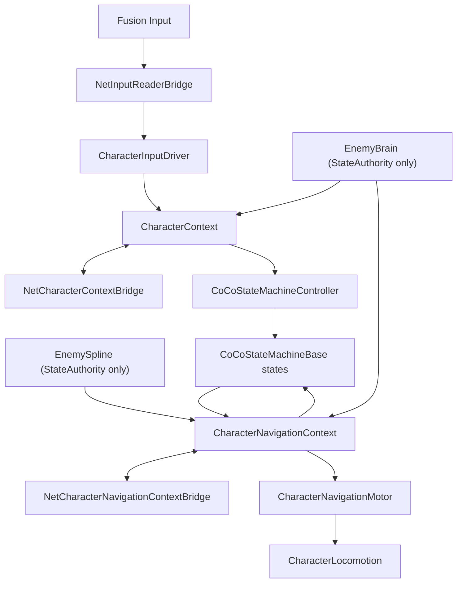

# CoCoFlow Network Samples

Network Samples 记录 CoCoFlow 在 Fusion 技术栈下的最小兼容层设计。本 sample 不恢复旧 NetworkSamples，也不在本轮提供可编译的 Fusion runtime；它先固定新的接入边界，后续实现应围绕这里的脚本命名和拓扑展开。

## Direction

网络层不应该成为第三套状态机，也不应该直接操作动画、战斗或移动末端组件。它只需要把网络输入和网络快照变成 CoCoFlow 已经认识的接口：

- `NetInputReaderBridge`: 桥接 Fusion input，实现 `ICoCoIntentSource<CoCoInputIntent>`，必要时兼容 `IInputStateProvider`、`IInputEventSource`、`IInputModeController`。
- `NetCharacterContextBridge`: 同步 `CharacterContext`，作为 `ICoCoContextProvider<CharacterContext>` 提供给 `CharacterLifeCycle`、`CharacterInputDriver`、`CoCoStateMachineController` 和 Enemy provider。
- `NetCharacterNavigationContextBridge`: 同步 `CharacterNavigationContext`，作为 `ICoCoContextProvider<CharacterNavigationContext>` 提供给 `EnemySpline`、Enemy 状态脚本和 `CharacterNavigationMotor`。

## Topology



## Sync Rules

- Authority writes gameplay facts into Context; proxies apply synchronized Context snapshots.
- Player intent starts as Fusion input and enters CoCoFlow through `NetInputReaderBridge`.
- Enemy intent is produced by `EnemyBrain` and `EnemySpline` only on StateAuthority.
- `CharacterContext` and `CharacterNavigationContext` should be synchronized by separate bridge scripts.
- Do not synchronize `Transform` references directly. Sync stable ids or `NetworkObject` references, then resolve local `Transform` references on each client.
- Preserve discrete input sequence fields such as `performedSequence`; do not sync one-frame actions as bare bools.

## Future Runtime Script Layout

```text
Assets/CoCoFlow/Network/
  Scripts/Runtime/Input/NetInputReaderBridge.cs
  Scripts/Runtime/Context/NetCharacterContextBridge.cs
  Scripts/Runtime/Context/NetCharacterNavigationContextBridge.cs
  Scripts/Runtime/Identity/NetEntityReferenceResolver.cs
```

## Setup Assistant

打开 `CoCoFlow/Setup/Setup Assistant`，在 `Add-ons` 区域勾选 `Network Samples`，默认安装目标是 `Assets/CoCoFlow/Network`。

Network Samples 假定使用 Photon Fusion。Fusion 不属于 CoCoFlow 主包依赖，应保留在 sample/add-on 层。
