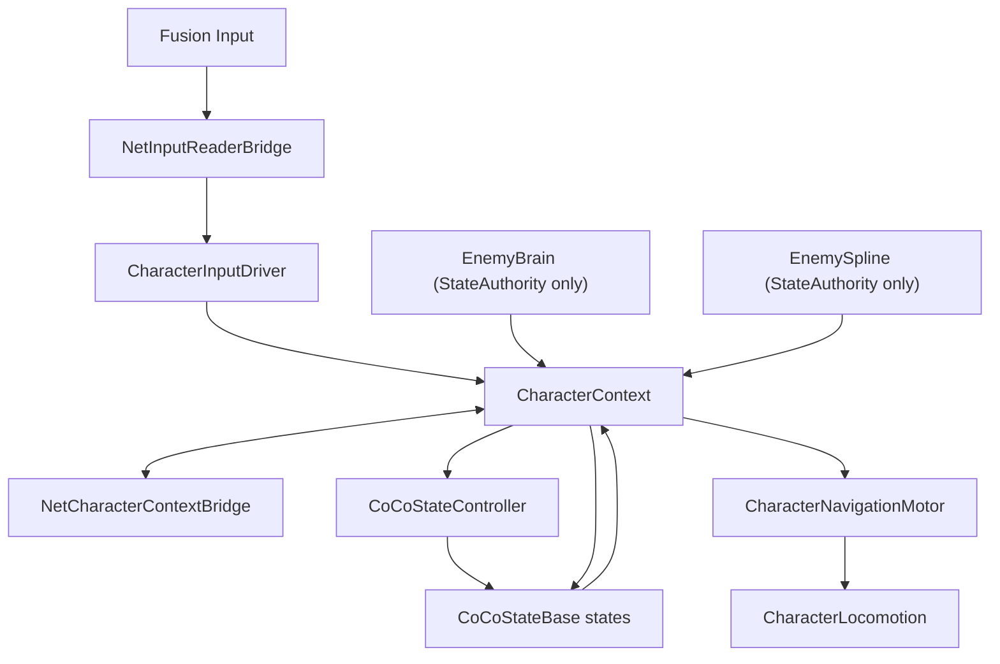

# CoCoFlow Network Samples

Network Samples 记录 CoCoFlow 在 Fusion 技术栈下的最小兼容层设计。本 sample 不恢复旧 NetworkSamples，也不在本轮提供 Fusion runtime；它先固定新的接入边界，并提供一个无 Fusion 依赖的 Persistence container event bridge 作为事件同步示例。

## Direction

网络层不应该成为第三套状态系统，也不应该直接操作动画、战斗、IK 或移动末端组件。它只需要把网络输入和网络快照变成 CoCoFlow 已经认识的接口：

- `NetInputReaderBridge`: 桥接 Fusion input，实现 `ICoCoIntentSource<CoCoInputIntent>`，必要时兼容 `IInputStateProvider`、`IInputEventSource`、`IInputModeController`。
- `NetCharacterContextBridge`: 同步 `CharacterContext`，包含 `CharacterContext.Navigation` 导航 facts，作为 `ICoCoContextProvider<CharacterContext>` 提供给 `CharacterLifeCycle`、`CharacterInputDriver`、`CoCoStateController`、Enemy provider 和 `CharacterNavigationMotor`；网络场景可用它替换或喂给本地 `CharacterContextProvider`。

## Topology



## Sync Rules

- Authority writes gameplay facts into Context; proxies apply synchronized Context snapshots.
- Player intent starts as Fusion input and enters CoCoFlow through `NetInputReaderBridge`.
- Enemy intent is produced by `EnemyBrain` and `EnemySpline` only on StateAuthority.
- Synchronize `CharacterContext` as the single character state payload; navigation facts live under `CharacterContext.Navigation`.
- Do not synchronize `Transform` references directly. Sync stable ids or `NetworkObject` references, then resolve local `Transform` references on each client.
- Preserve discrete input sequence fields such as `performedSequence`; do not sync one-frame actions as bare bools.
- Keep one `CoCoStateController` per character state system. Ordered State Layers are local gameplay topology, not separate network controllers.
- Animation Rigging and IK should be driven through explicit synchronized facts or local-only operation components after the business contract is stable.

## Future Runtime Script Layout

```text
Assets/CoCoFlow/Network/
  Scripts/Runtime/Input/NetInputReaderBridge.cs
  Scripts/Runtime/Context/NetCharacterContextBridge.cs
  Scripts/Runtime/Identity/NetEntityReferenceResolver.cs
```

## Setup Assistant

打开 `CoCoFlow/Setup/Setup Assistant`，在 `Add-ons` 区域勾选 `Network Samples`，默认安装目标是 `Assets/CoCoFlow/Network`。

Network Samples 假定使用 Photon Fusion。Fusion 不属于 CoCoFlow 主包依赖，应保留在 sample/add-on 层。
